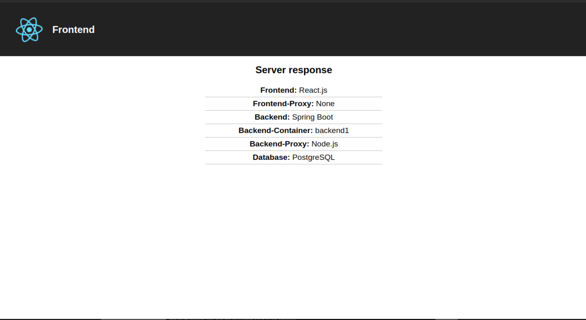

# 1. Что делает каждая из директив в docker-compose.yml?
     - version - устанавливает верисю схемы, которую мы 
    будем использовать;
     - volumes - объявляет доступные volume-ы
     - services - объявляет сервисы в узле docker-compose
     - container_name - устанавливает имя контейнера
     - image - указывает образ с docker hub, или другого 
    удалённого репозитория образов, который нужно скачать
    для этого контейнера
     - environment - блок, в котором можно указать 
    переменные окружения для контейнера
     - ports - блок, в котором можно указать связи между
    портами хоста и портами контейнера
     - build - блок, в котором описыватеся, как собрать
    образ для этого контейнера

## Чем отличаются 3 варианта использования volumes?
1. Использование именованных volume-ов, как в случае с 
postgres-data-volume. В этом случае создастся 
хранилище, которое будет примонтировано к указанному
пути, и всё сохранённое там будем храниться в этом 
именованном volume
2. Монтирование, как в случае с data.sql в контейнере 
postgres указывает, что все изменения в этом файле, 
которые произошли внутри контейнера, отобразятся
в файле на хостовой машине
3. Есть ещё 3 вариант использования volumes, когда тома
будут созданы и сохранены в оперативной памяти хоста,
что увеличит скорость доступа к ним

# 2. Что делает каждая из директив во всех Dockerfile?
    - ARG - задаём переменную окружения, которая будет
    доступа только на этапе сборки образа
    - FROM - указываем базовый образ, на основе которого
    будет собирать текущий
    - WORKDIR - указываем директорию, в которой будут 
    выполняться последующие директивы RUN, CMD, 
    ENTRYPOINT, COPY и ADD (по сути, просто делаем cd
    внутри контейнера)
    - COPY - копирует файл/каталог с хоста в образ
    - RUN - выполняет команду заданную команду в образе
    - EXPOSE - указываем, что в контейнере будет 
    запущено приложение, которое слушает указанный порт
    - CMD - указываем команду, которая запустится внутри
    контейнера, собранного на основе этого образа

## Что означает повторение директивы FROM?
Если у нас в Dockerfile несколько раз прописана директива 
FROM, то тогда происходит сборка итогового образа в 
несколько этапов. Каждый этап представляет собой 
промежуточный образ, который можно будет использовать
как базовый в последующих образах этого Dockerfile

## Чем RUN отличается от CMD?
RUN - выполняется при сборке образа. CMD - выполняется 
при запуске контейнера, собранного на основе этого образа

# 3. За что отвечает каждый из параметров команды docker-compose?
    - build - мы собираем образы всех сервисов, для 
    которых указана директива build
     - up - мы запускаем наш кластер сервисов. Где нужно,
    производится docker pull образов с удалённых 
    репозиториев
    - down - мы выключаем наш кластер сервисов.
    - rm - удаление контейнера
    - -d - запускаем сервисы в фоновом режиме
    - --rmi - удаляем образы контейнеров после их 
    остановки
    - --remove-orphans - удаляем все контейнеры, сети 
    и тома, которые после остановки контейнеров больше
    нигде не используются
    - -f - принудительное удаление контейнера, даже если
    он сейчас запущен
    - -s - остановка контейнера перед его удалением
    - -v - удаляем тома, связанные с удаляемым контейнером

# 4. Запустите контейнеры и выведите на экран их логи
Всё работает. Прилагаю скрин того, что отобразилось по
адресу http://localhost:22002:

# 5. Напишите Dockerfile для сервиса nginx. Добавьте сервис в docker-compose.yml.
Вот такой Dockerfile получился для сервиса nginx:

    FROM nginx
    COPY ./default.conf /etc/nginx/conf.d/default.conf
    COPY ./50x.html /etc/share/nginx/html
    CMD ["nginx", "-g", "daemon off;"]

И вот так я добавил его в docker-compose.yml:

    nginx:
        container_name: nginx.service
        build:
            context: ./nginx
            dockerfile: Dockerfile
        ports:
            - "22000:80"
        volumes:
            - ./nginx-data/upstreams.conf:/etc/nginx/conf.d/upstreams.conf
# 6. Запустите сервис nginx. Проверьте что он отвечает по ссылке http://localhost:22000/
Запустил. Проверил, отвечает корректно. Скрин 
прикладывать не вижу смысла, с прошлого раза, 
кроме адреса, ничего не изменилось)

# 7. Добавьте сервис backend2 в docker-compose.yml. Запустите его.
Добавил сервис backend2 следующим образом:

    backend2:
        container_name: backend2.service
        build:
            context: backend
        ports:
            - "22004:7000"
        volumes:
            - ./backend2-data/application.properties:/app/application.properties

При обращении по адресу http://localhost:22004/api/info 
получил следующий ответ:

    [
        {
            "name":"Backend",
            "text":"Spring Boot"
        },
        {
            "name":"Backend-Container",
            "text":"backend2"
        },
        {
            "name":"Backend-Proxy",
            "text":"None"
        },
        {
            "name":"Database",
            "text":"PostgreSQL"
        }
    ]

# 8. Настройте балансировку в конфиге upstreams.conf и перезапустите контейнер nginx.

Настроил, проверил, работает. Для этого просто требовалось
добавить следующую строчку в upstreams.conf:

    server backend2.service:7000;